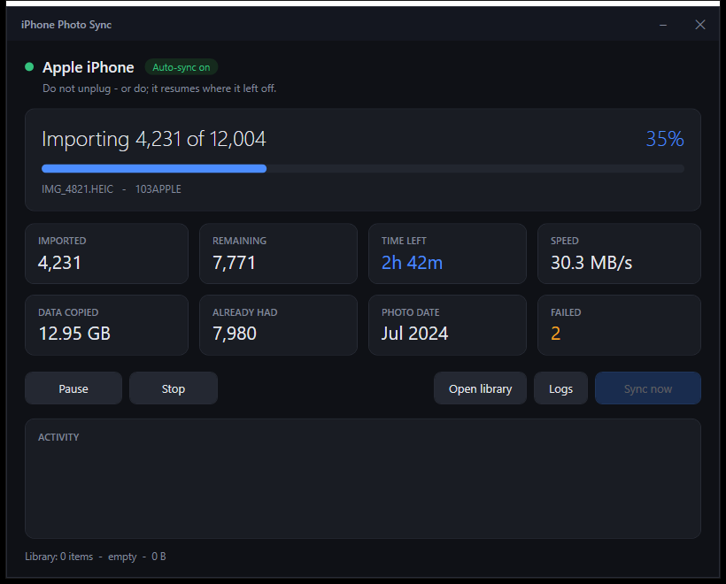

# iPhone → PC photo sync

**Plug the cable in. Unlock the phone. Walk away.**

Automatic, incremental, one-way sync of an iPhone camera roll to a Windows PC —
with a live dashboard, pause/resume, and a metadata catalogue you can group into
trips and events.



New photos and videos land in `Library\YYYY\YYYY-MM\`, get mirrored to a second
drive, and every file's metadata is catalogued.

> **100% local.** Nothing here touches the network — no iCloud, no Apple ID, no
> account, no telemetry, no cloud of any kind. It reads the camera roll over the
> USB cable (MTP, the same thing Explorer uses) and writes to your own disks.

**Requires:** Windows 10/11 + PowerShell 5.1. Nothing to install — no iTunes, no
Apple services, no third-party software. Built for an **iPhone 14**; works with
any iPhone or iPad.

## Quick start

```powershell
.\Install (run me once).cmd    # registers the logon watcher
.\Dashboard.cmd                # live progress, pause/resume/stop
```

Then set **Settings → Photos → Transfer to Mac or PC → Keep Originals** on the
phone (see below — this one matters), plug in, and unlock.

---

## One-time setup on the phone

**Settings → Photos → Transfer to Mac or PC → Keep Originals**

This is the single most important setting. On the default ("Automatic"), iOS
transcodes HEIC→JPEG during transfer: slow, lossy, and it produces a slightly
different file size each time — which breaks the "do I already have this?" check
and would re-copy your whole library on every connection.

Then unlock the phone and tap **Trust This Computer** the first time.

---

## Daily use

Nothing. The watcher runs at logon, notices the phone, waits for you to unlock
it, and syncs. A tray balloon tells you what came in.

Want to watch it happen: **`Dashboard.cmd`**.

---

## The dashboard

`Dashboard.cmd` (or `Sync-GUI.ps1`) opens a live view:

- connection state, and whether auto-sync is actually running
- imported / remaining / failed counts, data copied, throughput
- a real ETA, computed from recent bytes-per-second, not a guess
- which photo's date range is currently being filed
- **Pause / Resume** and **Stop**
- a rolling tail of the activity log

The GUI is only a viewer and remote control — it never does the copying itself.
So it shows the sync correctly whether *you* started it or the watcher did, and
**closing the window never interrupts a running sync.**

### Unplugging mid-transfer

Safe, by design, three different ways:

- **Stop** finishes the current file and ends cleanly.
- **Pause** holds between chunks; **Resume** continues.
- **Just yanking the cable** is also fine — the run detects the device is gone,
  stops, and the next connection picks up where it left off.

A file is recorded as "have it" only *after* it has been copied and its byte
size verified against the phone, so a half-copied file is discarded rather than
remembered.

---

## Files

| File | What it is |
|---|---|
| `Dashboard.cmd` | Opens the GUI. |
| `Sync Now.cmd` | One manual sync, with a console window. |
| `Install (run me once).cmd` | Registers the logon watcher. Already run. |
| `Sync-iPhone.ps1` | The engine: scan, copy, verify, file, catalogue. |
| `Watch-iPhone.ps1` | Polls for the phone; fires the engine once per connection. |
| `Sync-GUI.ps1` | The dashboard. |
| `Rebuild-Catalog.ps1` | Re-reads metadata from every file in the library. |
| `Group-Trips.ps1` | Clusters the catalogue into trips and events. |
| `lib\Metadata.ps1` | Metadata extraction, shared by the above. |
| `Uninstall.ps1` | Removes the watcher. Never touches your photos. |
| `config.json` | Paths and options. |
| `state\index.tsv` | Append-only record of everything ever imported. |
| `state\catalog.jsonl` | One JSON record per file: dates, GPS, camera, hash. |
| `logs\` | `sync-YYYYMMDD.log`, `watcher.log`. |

---

## Metadata and grouping

Every imported file gets a record in `state\catalog.jsonl` — one JSON object per
line:

```json
{"Key":"100APPLE/IMG_4821.HEIC|2847193","File":"2024\\2024-07\\IMG_4821.HEIC",
 "Name":"IMG_4821.HEIC","Kind":"image","Size":2847193,
 "DateTaken":"2024-07-14T10:23:11.000+04:00","DateTakenSource":"exif",
 "Width":4032,"Height":3024,"CameraMake":"Apple","CameraModel":"iPhone 14",
 "GpsLat":25.2048,"GpsLon":55.2708,"Sha256":"2ADFEC..."}
```

**The catalogue is derived, never authoritative.** Every photo still carries its
own original EXIF/GPS embedded in the file, exactly as the iPhone wrote it, and
nothing here ever modifies a photo. If the catalogue is lost, wrong, or was
built before you improved metadata extraction, just run:

```bash
powershell -ExecutionPolicy Bypass -File "Rebuild-Catalog.ps1"
```

It re-reads everything from the files. `-NoHash` makes it much faster.

### Trips and events

```bash
powershell -ExecutionPolicy Bypass -File "Group-Trips.ps1" -MakeFolders
```

Sorts by capture time, then starts a new cluster on a time gap (`-GapHours`,
default 14) or a big location jump (`-JumpKm`, default 60). A cluster whose
centre is more than `-HomeKm` (default 40) from home is a **trip**; otherwise
it's an **event**.

"Home" is inferred as the ~11 km cell where you have photos on the most
*separate days* — deliberately not the most photos, because one camera-heavy
holiday would otherwise outvote a whole year at home and every real trip would
vanish into "home".

`-MakeFolders` builds `Groups\<name>\` out of **hard links**: browsable folders
that reference the same bytes and cost no extra disk space. Rename them freely,
delete them any time — the library is untouched. Results also go to
`state\trips.json` for anything you want to build on top.

There is no reverse geocoding, so groups are named by date and distance rather
than "Tokyo" — naming a place would require sending your coordinates to a web
service, which is exactly what this setup avoids.

### Getting better metadata (recommended)

Out of the box, metadata comes from the Windows property system, which **reads
HEIC poorly or not at all** unless you install the free *HEIF Image Extensions*
from the Microsoft Store. Since an iPhone 14 shoots HEIC by default, you may get
sparse dates and no GPS.

The robust fix is **exiftool** — one portable `.exe`, no installer, no network
at runtime, reads HEIC/MOV/Live Photos and GPS properly. Drop it at
`tools\exiftool.exe` and every script picks it up automatically and says so in
the log. Then re-run `Rebuild-Catalog.ps1` to upgrade every existing record.

Either way your photos keep their original embedded EXIF, so nothing is lost by
waiting — you can always re-catalogue later.

---

## First run will take hours

An iPhone 14 is Lightning, i.e. **USB 2.0** — roughly 30–40 MB/s at best, no
matter which port you use. Expect **3–8 hours for ~20,000 items**. Use a port
directly on the motherboard rather than a hub, and start it before bed.

Live Photos arrive as a `.HEIC` **and** a `.MOV` with the same base name, so
your file count will be noticeably higher than your photo count.

Later runs are incremental and take seconds to minutes. Watch progress in the
dashboard, or:

```bash
Get-Content "$env:USERPROFILE\Desktop\iPhone Photos\logs\sync-$(Get-Date -f yyyyMMdd).log" -Wait -Tail 20
```

---

## How it decides what's new

Each item is keyed on `album / filename | exact byte size`, e.g.
`100APPLE/IMG_4821.HEIC|2847193`, recorded in `state\index.tsv` after a verified
copy.

- **Deleting from the library is permanent.** A photo you delete from `Library\`
  will not come back. That's deliberate — it makes the library curatable. (To
  force a re-import, delete its line from `state\index.tsv`.)
- **Deleting from the phone doesn't delete from the PC.** One-way and additive:
  this is an archive, not a mirror.
- Filename collisions across albums (iOS reuses `IMG_0001` after rollover) get
  `_2`, `_3` suffixes. Byte-identical files are skipped, not duplicated.

---

## Backups — read this

`config.json` mirrors the library to `E:\Backups\iPhone Photos`. But **C: and E:
are both internal NVMe drives in this one machine.** That survives one drive
dying. It does not survive theft, fire, a bad PSU, ransomware, or deleting the
wrong folder.

Two copies in one box is not a backup. Add a third, local one:

- **External USB drive.** Point `BackupPath` at it. The mirror is skipped
  silently when the drive isn't connected, so it just works whenever you plug
  it in. Keep it unplugged the rest of the time — that's also your ransomware
  protection.
- **A second machine or NAS** on your network, if you'd rather not handle a
  drive.

`MirrorDeletes` is `false`, so the backup only ever grows: deleting from the
library never propagates. Set it to `true` only if you want an exact mirror.

---

## Options in `config.json`

| Key | Meaning |
|---|---|
| `LibraryPath` | Where photos live. Either slash style works, and `%USERPROFILE%`-style environment variables are expanded. |
| `BackupPath` | Second copy target. `""` disables it. |
| `MirrorDeletes` | `false` = backup only grows (safe). `true` = exact mirror. |
| `OrganizeByDate` | `true` = `YYYY\YYYY-MM\`. `false` = one flat folder. |
| `DeviceNamePattern` | Regex matched against the device name under "This PC". |
| `PollSeconds` | How often the watcher looks for the phone. |
| `UnlockWaitSeconds` | How long a sync waits for you to unlock before giving up. |
| `ChunkSize` | Files copied per batch. Smaller = snappier Pause/Stop. |
| `CaptureMetadata` | Write `catalog.jsonl` during sync. |
| `HashFiles` | SHA256 each file (integrity + dedup). Slower. |
| `Notify` | Tray balloon when a sync finishes. |
| `LogRetentionDays` | How long to keep sync logs. |

Changes apply on the next sync. Changing `PollSeconds` needs the watcher
restarted — `Uninstall.ps1` then `Install (run me once).cmd`.

---

## Version control

This folder is a git repo tracking **the scripts only**. `.gitignore` excludes
`Library/`, `Groups/`, `state/`, `logs/` and `tools/` — git is a terrible way to
store 100 GB of photos, and your backup is the mirror, not this repo.

---

## Troubleshooting

**Nothing happens when I plug in.** Check `logs\watcher.log`. No "Device
connected" line means the name didn't match `DeviceNamePattern` — open This PC,
read the exact name under Portable Devices, widen the regex. Also check the
dashboard says *Auto-sync on*; if it says off, the watcher task isn't running.

**"No unlocked iPhone found" though it's unlocked.** It re-locked during the
wait, or Trust wasn't granted. Unlock and hit **Sync now**.

**Some files time out.** Usually a cable or hub. They're logged as warnings, not
recorded, and retried automatically next connection.

**Dates look wrong / photos in the wrong month folder.** Almost always missing
HEIC metadata support — see *Getting better metadata* above, then re-run
`Rebuild-Catalog.ps1`.

**Start over.** Delete `state\index.tsv`. Everything is rescanned; files already
on disk with matching sizes are skipped rather than duplicated.
